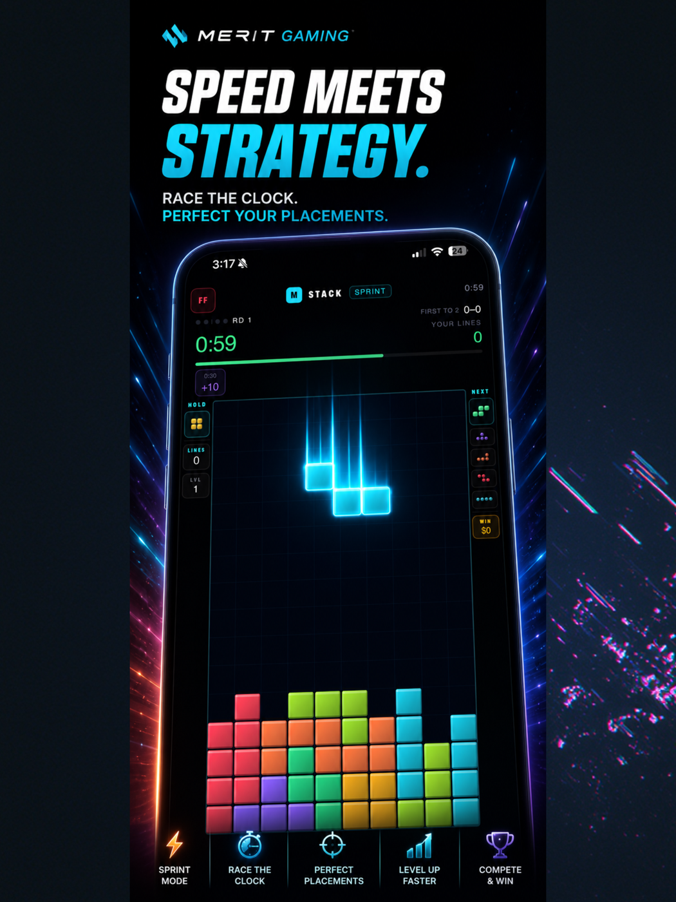
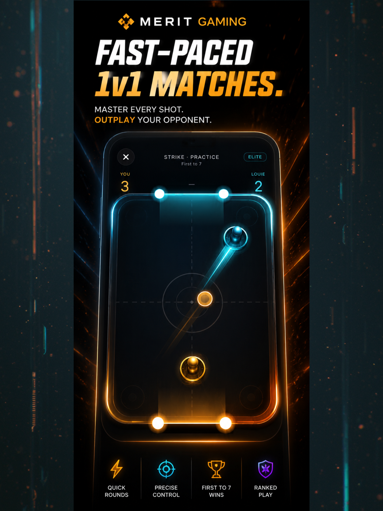

# Merit

**Skill-based head-to-head mobile gaming with real-money and virtual-coin economies.**
iOS-native (SwiftUI + Unity), Firebase Cloud Functions backend, server-authoritative match verification.

<p align="left">
  
  
  
  
  
  
</p>

> **Status: submitted to the App Store — in review.**
> Bundle ID `com.joinmeritgaming.merit` · v1.0 · 129 Cloud Functions live in production.
> _App Store link will be added here on approval._

> **About this repository.** This is a portfolio repository. It contains the product write-up,
> architecture documentation, and a small set of sanitized code excerpts. The application source
> is proprietary and lives in a private repository. See [What's not here](#whats-not-in-this-repo).

---

## Contents

- [Screenshots](#screenshots)
- [What Merit is](#what-merit-is)
- [Technology stack](#technology-stack)
- [Architecture](#architecture)
- [Features I built](#features-i-built)
- [Production problems I solved](#production-problems-i-solved)
- [How I used and reviewed Claude Code](#how-i-used-and-reviewed-claude-code)
- [Code examples](#code-examples)
- [What's not in this repo](#whats-not-in-this-repo)

---

## Screenshots

| | |
|:---:|:---:|
|  |  |
| **Lobby** — dual-economy header, featured match, ranked game tiles | **Stack** — sprint mode, piece queue, live line race |
|  |  |
| **Strike** — real-time 1v1, first to 7 | **Ranks** — six-tier ladder, division progress |

---

## What Merit is

Merit is a mobile competition platform where two players compete head-to-head at **skill-based
minigames** for a prize pool. It is explicitly not a game of chance — every outcome is decided by
player performance, and the server independently verifies that performance before any money moves.

Players compete in one of two parallel economies that never mix:

- **Cash** — real-money entry fees held in escrow, settled to the winner minus a tiered platform
  fee. Gated by identity verification, geographic eligibility, and responsible-play limits.
- **Coins** — a virtual currency with no cash value, purchasable via StoreKit or earned. Coins are
  the on-ramp: completing 10 coin placement matches in a game unlocks cash play for that game.

Four games ship in the client:

| Game | Type | Result authority |
|---|---|---|
| **Stack** | Falling-block puzzle (race / survival / sprint) | Server replays the full run from an action log |
| **Strike** | Real-time 1v1 air hockey | Host-simulated + server replay verification of dual input logs |
| **Pocket** | 1v1 eight-ball billiards | Server-canonical physics (client never simulates competitive outcomes) |
| **Outfox** | 3-lane endless runner | Deterministic fixed-tick sim with tick-indexed input log |

Two match formats: **Live** (real-time matchmaking queue) and **Arena** (asynchronous — post a
challenge, someone accepts within 3 hours, both play their own seeded run within 30 minutes).

---

## Technology stack

**iOS client** — Swift 5.9, SwiftUI (iOS 17+), `@Observable` stores, Swift Concurrency.
178 Swift files, ~52k lines. StoreKit 2 for in-app purchases, Stripe PaymentSheet for deposits,
Core Location for eligibility, LocalAuthentication, UserNotifications + FCM.

**Unity as a Library (UaaL)** — Unity 6.5 embedded as a framework inside the native app for 3D
rendering only (Pocket's billiard table and balls, Outfox's jungle world). All physics and game
logic stay in Swift/TypeScript; Unity receives state over a bidirectional native bridge and renders
it. 24 C# scripts.

**Backend** — Firebase Cloud Functions v2 (Node 22, TypeScript, strict mode). 108 modules,
~31k lines, **129 functions deployed to production** — callables, HTTPS webhooks, Firestore
triggers, and scheduled sweepers. Firestore as the state store with hand-written security rules.

**Real-time game server** — standalone Node + WebSocket authoritative server (Docker, Fly.io) for
low-latency real-time matches, with HMAC-signed match tokens and a trusted result-reporting channel
back into Cloud Functions.

**Payments & identity** — Stripe (PaymentIntents, Connect payouts, Identity for KYC),
Apple StoreKit 2 with server-side receipt verification via Apple's App Store Server Library, plus
App Store Server Notifications V2 for refund clawback.

**Testing** — 812 backend unit tests (`node:test`), 23 Firestore security-rules tests against the
emulator, 274 standalone game-engine tests, plus cross-language golden-fixture parity suites.
**1,109 tests passing.**

---

## Architecture

```
┌──────────────────────────────────────────────────────────────┐
│  iOS App (SwiftUI)                                           │
│  ┌────────────┐  ┌──────────────┐  ┌───────────────────────┐ │
│  │ @Observable│  │ Game engines │  │ Unity as a Library    │ │
│  │   stores   │  │ (Swift, det.)│──▶│ (3D render only)     │ │
│  └─────┬──────┘  └──────┬───────┘  └───────────────────────┘ │
└────────┼────────────────┼────────────────────────────────────┘
         │ callables      │ action log (every input, tick-stamped)
         ▼                ▼
┌──────────────────────────────────────────────────────────────┐
│  Cloud Functions (TypeScript)          App Check enforced    │
│                                                              │
│  ┌────────────────┐   ┌──────────────────────────────────┐   │
│  │ Match verifier │◀──│ Port of the SAME engine in TS    │   │
│  │  replay + judge│   │ (bit-exact parity, golden-tested)│   │
│  └───────┬────────┘   └──────────────────────────────────┘   │
│          │ verified winner                                   │
│  ┌───────▼────────────────────────────────────────────────┐  │
│  │ Settlement — single Firestore transaction:             │  │
│  │ release escrow · pay winner · rake · Elo · XP · ledger │  │
│  │ idempotent on a deterministic sha256 key               │  │
│  └────────────────────────────────────────────────────────┘  │
└──────────────────────────────────────────────────────────────┘
         │                                    │
         ▼                                    ▼
┌──────────────────┐              ┌─────────────────────────┐
│ Firestore        │              │ Stripe · StoreKit       │
│ deny-by-default  │              │ webhooks → idempotent   │
│ rules; wallets & │              │ credit                  │
│ ledgers are      │              └─────────────────────────┘
│ server-write-only│
└──────────────────┘
```

### The core idea: the client is never trusted with the result

A player's device simulates the match for responsiveness, but it also records **every input,
stamped with the tick it occurred on**. On submission the server replays that log through its own
port of the identical engine, seeded with a server-known seed the client cannot choose. The server's
computed score — not the client's claim — is what settles.

This produces three outcomes: `server_verified`, `server_rejected`, or `review_required`. Rejected
runs lose. When both sides are rejected, the match voids and both stakes are refunded — the design
rule throughout is **prefer a refund over an unfair payout**.

### Cross-language determinism

The replay only works if the Swift engine and the TypeScript engine produce **bit-identical**
output. That is enforced, not hoped for:

- Golden fixtures are generated from the real Swift engine and store floating-point state as
  **raw bit patterns**, not rounded decimals.
- The TypeScript suite replays those fixtures and asserts byte equality at every checkpoint.
- Any change to a gameplay mechanic must move Swift, TypeScript, and the fixtures together —
  otherwise the parity suite fails and legitimate players would start getting rejected.

Strike's engine went further: it is also ported to C# for the Unity path, giving a three-way
contract (Swift ↔ TypeScript ↔ C#) proven bit-exact across Apple Silicon and V8 — which required
replacing `libm` trig with a range-reduced polynomial written one operation per statement, so no
compiler could contract floating-point differently across targets.

### Money architecture

Every balance change flows through **one** function that:

1. Derives a ledger document ID by hashing a caller-supplied idempotency key (sha256).
2. Reads that ledger doc inside the transaction — if it exists, the mutation already happened and
   returns as a no-op.
3. Applies the delta, asserts the result has no negative balances, and writes the wallet, the
   append-only ledger entry (with `balanceBefore`/`balanceAfter`), and a sanitized user-visible
   activity row — atomically.

Because every settlement path derives its key deterministically (`match-settlement:{matchId}:{uid}`),
a webhook redelivery, a retried transaction, a scheduled sweeper, and a user action all collapse onto
the same ledger row. There is no code path that can pay twice.

Cash and coins are separated structurally: different collections, different queue buckets, different
callables, and mutual payload guards that reject a request carrying the other economy's fields.

---

## Features I built

**Competition**
- Elo-based ranking with a placement system (Bronze → Grandmaster), unified per game across modes
- Live matchmaking queues with skill windows, block-list filtering, and atomic pairing transactions
- Asynchronous Arena: post/accept challenges, seeded identical runs, deadline sweepers
- Account XP/level progression (1–100) decoupled from competitive skill rating
- Match replay and statement detail surfaces

**Economy**
- Stripe deposits (PaymentSheet), withdrawals with 2FA, fee quoting, and Connect payouts
- StoreKit 2 consumables with server-side JWS receipt verification, pinned Apple root certificates,
  account binding via `appAccountToken`, and refund clawback via App Store Server Notifications
- Virtual coin + diamond wallets, avatar cosmetics store, rewarded-ad grants with AdMob SSV
- Paginated, filterable financial statements with fee breakdowns and processor-ID redaction

**Trust & safety**
- Server-authoritative replay verification for every paid and ranked match
- Identity verification (Stripe Identity), geographic eligibility with restricted-state gating
- Responsible-play limits: deposit caps, cool-downs, self-exclusion, session reality checks
- Rate limiting, App Check enforcement on all 100+ callables, audit event trail
- Deny-by-default Firestore rules — clients cannot write a single wallet, ledger, or rating document

**Social**
- Friends, presence, private challenges that create real staked matches, invite referral rewards
- Push notifications, in-app notification inbox, deep linking

---

## Production problems I solved

### 1. A replay exploit that let a player farm the same seed

Arena matches are deterministic: same seed, same pieces. A player could start a run, see an
unfavourable board, force-quit before submitting, and re-enter — replaying the *identical* seed with
perfect foreknowledge, unlimited times, at no cost.

**Fix:** attempt consumption. Entering a run now writes a start timestamp inside a transaction and
refuses re-entry past a short reconnect grace period. Submission requires a consumed attempt, and a
started-but-never-submitted run forfeits via the deadline sweeper. Submissions also carry a
wall-clock ceiling — a log claiming more elapsed game time than has passed on the server clock is
rejected, closing synthetic faster-than-real-time logs.

### 2. Anti-cheat that was rejecting honest players

The action-rate heuristic counted raw input records. But held inputs auto-repeat at ~20/s — an
honest player holding soft-drop while sliding generated enough records to trip the "superhuman"
threshold. Meanwhile a genuinely exploitable hole was open: gravity was a *client-side* timer, so a
modified client could simply omit gravity ticks and play with no downward pressure at all.

**Fix:** collapse machine-generated repeats into single gestures before rate-checking, and add a
gravity-cadence cross-check — over the whole log, recorded ticks must meet a fraction of what the
level curve demands for the elapsed time. Honest clients sit near 100%; a zero-gravity client sits
near zero. False rejections went away and a real exploit closed in the same pass.

### 3. "First reporter wins" in real-time matches

Real-time Strike results were reported by whichever client finished first. A dishonest player could
report themselves the winner and take the pool.

**Fix:** dual confirmation. A winner is paid only when **both** participants independently report a
decisive, mutually consistent result. A conflict, a single report, or a non-decisive report voids
and refunds. Combined with a shortened void deadline and a sweeper backstop, no unilateral report
can ever produce a payout.

### 4. A paid match path with no settlement

An audit found a legacy challenge flow that locked escrow on accept but had no match pipeline behind
it — no settlement, no refund, and no sweeper coverage. Both players' funds would have stranded
indefinitely. It also bypassed the geographic and placement gates.

**Fix:** hard-rejected paid stakes on that path before any escrow lock, removed the escrow block
entirely, and rebuilt the flow on the proven coin-staked session pipeline so settlement, sweepers,
and rating all applied unchanged. Verified against production data that no stranded funds existed.

### 5. Default-deny gating for anything not provably fair

Paid real-time Strike is *built* but **blocked by default** at three independent layers, because its
result is host-reported rather than server-derived. It requires an explicit config opt-in, and the
gate closes automatically the instant a live payment key is present. When the gate is closed,
already-escrowed sessions settle as **refund-both** rather than paying a client-reported winner.

Shipping a feature dark, with the unsafe path structurally unreachable, was consistently a better
trade than shipping it enabled and trusting a client.

### 6. Six-second cold-start on first tab open

Profile and Friends each fired their first Cloud Function call from their own view lifecycle. That
first call had to wait for a Firebase ID token, then mint an App Check attestation, then hit a cold
container — a ~6s blank screen on first launch, warm thereafter.

**Fix:** launch-time prefetch into shared `@Observable` stores with stale-while-revalidate — an
in-flight request is joined rather than duplicated, and errors keep the previous data instead of
blanking a loaded screen. The cold-start cost is now paid during Home-screen time, and tabs render
their last-known data instantly.

### 7. A SwiftUI state bug that froze a live match

Two-player Strike would hang: countdown stuck, one player frozen. The run loop was driven from
inside a `TimelineView` body, and SwiftUI **silently discards value-type `@State` writes made during
body evaluation**. The host's tick accumulator never grew, so the simulation never advanced, so no
authoritative snapshots were sent, so the guest never became ready.

**Fix:** move all per-frame mutated state into a reference-type holder (class), so mutations persist.
Reference types had been working by accident all along; the value types silently were not.

### 8. Physics that lied to the player

Pocket's aim guide modelled four infinite cushions and ignored the 12 rounded pocket-jaw colliders
the simulation actually used. Near-pocket shots promised travel the simulation interrupted. Separately,
the guide's continuous swept-circle test claimed contact on razor-thin tangents the discrete
micro-stepped simulation would sample straight past.

**Fix:** the guide now sweeps the same jaw colliders and gapped walls the simulation uses, plus a
conservative contact skin so a shown hit is always a hit the simulation registers. The guide is
allowed to under-promise by a fraction of a millimetre; it is never allowed to over-promise.

---

## How I used and reviewed Claude Code

Merit was built with Claude Code as the primary implementation tool over roughly three months. The
approach that made it work at this scale:

**A living project memory file.** A single `CLAUDE.md` at the repo root carries the architecture,
non-negotiable rules (banned vocabulary for compliance, the client↔server parity contract, the
"never deploy from a dirty tree" rule), and an append-only completion log. Every unit of work ends
by writing what was actually delivered, what was verified, what was deployed, and what is still
broken. New sessions start with full context instead of re-deriving it — and the log became the
audit trail I used to find several of the bugs above.

**Plan documents before code.** Each major system got a written plan first — scope, phases, open
decisions, explicit non-goals — reviewed and amended before implementation started. Large features
shipped in numbered phases with a verification gate at each one.

**Verification is part of "done."** No task counted as complete without the build passing, the test
suites passing with numbers recorded, and — for anything server-side — the deploy actually run. That
rule exists because it was learned the hard way: a Statements feature was built, unit-tested, and
declared finished while the callables were never deployed. The screen failed in production because
the functions did not exist. "Compiles and tests pass" is not "shipped."

**Where I overrode it.** Claude Code's output was reviewed critically, not accepted:

- It proposed a coin-rank namespace separate from cash ranks. I rejected the design — one game
  should not have two ladders — and had it collapse them into a unified rating with a migration path
  that merges legacy per-mode documents without losing progress.
- On repeated occasions it reported "BUILD SUCCEEDED" while the actual behaviour was wrong (an empty
  Unity scene shipping because the scene list was misconfigured; a framework missing its metadata
  bundle). The standing rule became: verify the artifact, not the exit code.
- Feature work that would have shipped a client-trusted result for real money was consistently
  redirected to ship dark behind a default-deny gate instead.
- It repeatedly proposed changing tuned physics constants to fix rendering complaints. Those were
  refused — a renderer must not silently disagree with the simulation.

**What I'd tell someone starting.** The bottleneck is not code generation; it is context and
verification. The memory file, the phase gates, and the "deploy is part of done" rule are what kept a
~85k-line multi-language codebase with real money in it coherent.

---

## Code examples

Five sanitized excerpts from the production codebase live in [`code-examples/`](code-examples/):

| File | What it shows |
|---|---|
| [`economy-guard.ts`](code-examples/economy-guard.ts) | Defense-in-depth payload guards keeping cash and coin economies structurally separate |
| [`idempotent-ledger.ts`](code-examples/idempotent-ledger.ts) | The read/write split that makes every balance change atomic and exactly-once |
| [`replay-verification.ts`](code-examples/replay-verification.ts) | The shape of server-side match replay verification (thresholds redacted) |
| [`parity-fixture.md`](code-examples/parity-fixture.md) | How cross-language bit-exact determinism is proven with golden fixtures |
| [`prefetch-store.swift`](code-examples/prefetch-store.swift) | The stale-while-revalidate `@Observable` store that fixed cold-start latency |

Anti-cheat threshold *values* are deliberately redacted — publishing the exact tolerances would tell
an attacker precisely how far to push without tripping them. The architecture is shown in full.

---

## What's not in this repo

This is a portfolio repository. It intentionally excludes:

- The iOS application source (178 Swift files)
- The Cloud Functions source (108 TypeScript modules)
- Firestore security rules, the real-time game server, and Unity project sources
- All credentials, API keys, service accounts, and configuration
- Specific anti-cheat thresholds and tolerances

No secrets have ever been committed to any Merit repository — Firebase config plists, `.env` files,
and service-account JSON are gitignored, and the git history is clean. Payment secrets live in
Firebase Secret Manager.

---

## Author

**Afan Rashid** — product, architecture, and implementation.
Built April–July 2026.
